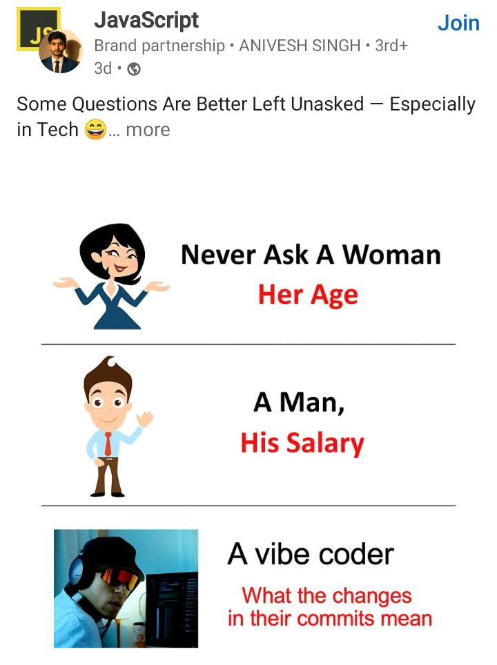

<h1 align="center">Hi 👋, I'm TheKingTermux</h1>

<h3 align="center">Just a young man whose hobby is coding when has a free time</h3>

- 🔭 I’m currently working on [Tachiyomi's and Mihon's Extensions repository](https://github.com/keiyoushi/extensions-source)

- 🤝 My currently working on [My Old Personal Tachiyomi's Extensions repository](https://github.com/TheKingTermux/tachiyomi-extensions) (Old), [My New Personal Tachiyomi's Extensions repository](https://github.com/TheKingTermux/extensions-source) (New) for Indonesian extension only

- 🌱 I’m currently learning [Kotlin](https://kotlinlang.org/), [JSoup](https://jsoup.org/), [OkHttp](https://square.github.io/okhttp/), etc about Android Application Development, Website Development, Game Modder, and anything about Server's

- 🤖 My WhatsApp Bot using Node.JS are available at [here](https://github.com/TheKingTermux/alice) [[Stopped due leak on access vulnerability (GitHub Advisory Database)]](https://github.com/TheKingTermux/alice/issues?q=is%3Aissue+is%3Aopen+label%3ASecurity+)

- 🗂️ I'm a web designer and web developer in [Lotus Academy](https://lomyform.blogspot.com) (Online) and [Website Pengaduan Masyarakat](https://github.com/UKKWariors/Website-Pengaduan-Masyarakat-Remake) (Offline)

- 👨‍💻 Another of my projects are available at [here](https://github.com/TheKingTermux?tab=repositories)

- ⚡ My another hobby is [**Watching an Anime, Reading a Manga, Manhua, and Manhwa**](https://anilist.co/user/TheKingTermux/) and playing [some online games](#my-game-curently-playing)

<h3 align="center">About Me Simply</h3>
</a>

<h3 align="center">Interested in</h3>
</a>

<h3 align="center">I'm from</h3>
  

  

<h3 align="center">My free time:</h3>
<h5 align="center">Times may change, depending on my conditions</h5>

  <a align="center" href="https://www.worldtimebuddy.com/utc-to-indonesia-jakarta?pl=1&lid=100,1642911&h=100&hf=1" target="blank">Use UTC+7 (Jakarta)</a>

<h3 align="center">Current Status Now:</h3>
<h5 align="center"><b>Currently remembering the lessons that I've passed since more than 2 years without coding, I ALMOST FORGOT EVERYTHING (⁠─⁠.⁠─⁠|⁠|⁠）</b></h5>

| Day | Time |
|:-----:|:---:|
| Weekday | 15.00 - 17.00   19.00 - 21.00 |
| Friday* | 12.30 - 16.00 |
| Weekend | 09.00 - 11.30   15.00 - 17.00   19.00 - 21.00 |
| *Friday is | Special days for me and therefore that's why i separated it |

<h3 align="center">Connect with me:</h3>
<h5 align="center"><b>I recommend reading the NOTE section below first if it is a problem regarding the Tachiyomi Extension / etc. And also if you want to contact me, please contact me via WhatsApp, I rarely use the other social media listed below</b></h5>

| Social Media | Respond Status |
|:---:|:---:|
|  | **Fast Respond*** |
|  | **Slow Respond** |
|  | **Very Slow Respond** |
|  | **Very Very Slow Respond** |
|  | **Very Very Very Slow Respond** |
| *Fast Respond When | [You in My Free Time](#my-free-time) |

<h3 align="center">My Game Curently Playing:</h3>

| Game | UID / Username |
|:---:|:---:|
|  | 813646627 / Alice |
|  | UwUHeadshot69xD |
|  | TheKingTermux #404 |
|  | TheKingTermux404 |

- Note :

1. (dd/mm/yy)
(15/12/22)
My laptop is broken, I can't make a contribution in Tachiyomi Extension, and even i can't do my school project / assignment because of this problem.

2. (dd/mm/yy)
(14/03/23)
I just changed my WhatsApp number, because the old number was blocked for some reason, if you need me or you are the person who chatted before, please [chat my WhatsApp again](#connect-with-me).

3. (dd/mm/yy)
(01/06/23)
My laptop is broken again and under repairing, if you want me to create some Tachiyomi Extension, sorry i can't, if you need your request to created by someone, you can create a [Source Request on Keiyoushi Tachiyomi and Mihon Extension](https://github.com/keiyoushi/extensions-source/issues/new?template=02_request_source.yml), or you need a report of change the Extension BaseUrl, you can create a [Source URL Change Report on Keiyoushi Tachiyomi and Mihon Extension](https://github.com/keiyoushi/extensions-source/issues/new?template=03_report_url_change.yml), or you need a report some issues related to your problem with everything about Extension,  you can create a [Source Issue Report on Keiyoushi Tachiyomi and Mihon Extension](https://github.com/keiyoushi/extensions-source/issues/new?template=01_report_issue.yml). Thanks for contacting me.

4. (dd/mm/yy)
(13/03/24)
I have an PC now, but it broken, Soo i need to troubleshooting that PC, i don't have a time for doing that, Soo i need to troubleshoot and maybe need to Save money to buy damaged components, maybe it take some time, but still progressing.

5. (dd/mm/yy)
(23/04/24)
I went to my friend's house to do troubleshooting because our PCs were similar, and it turned out that the ~RAM, CPU and~ motherboard were damaged. Luckily the PSU, RAM, CPU and VGA Card can still be used normally, and I have to save to buy ~RAM, CPU and~ motherboard at the same time.
_Edited on (04/06/24)_

6. (dd/mm/yy)
(01/05/24)
I'm currently busy preparing for my older brother's wedding, so I will stop coding for a while until the wedding is finished, maybe until the beginning of July, but Idk if it could be longer than I thought.

7. (dd/mm/yy)
(01/06/24)
I started to think, instead of buying a used product, and I don't know whether it will last long, or it will be damaged immediately, or maybe it is an item that is already damaged (because the guarantee has been lost many time ago), then I finally decided to buy all new products for the Motherboard, RAM and CPU. Because the PSU and VGA Card are still normal and can be used, maybe in the future I will upgrade them.

8. (dd/mm/yy)
(03/07/24)
Finally I have bought a motherboard, RAM and CPU thanks to the help of my mother and brother, I really love them

9. (dd/mm/yy)
(20/09/25)
Finally i have bought a Monitor, my hard working is aleardy been paid off little by little, now my goal is saving for a GPU and PSU, for the Case, Gaming Chair, Fan, Camera, Mic, even Mousepad i think would be later far beyond after getting some good Pc Parts
_Edited on (13/10/25)_

10. (dd/mm/yy)
(12/12/25)
Finally i have bought a PSU, now my goal is saving for a GPU, for the Case, Gaming Chair, Fan, Camera, Mic, even Mousepad i think would be later far beyond after getting some good Pc Parts

<h3 align="center">Meme Today</h3>

<!-- START_SECTION:daily_meme -->

  

<!-- END_SECTION:daily_meme -->

<h3 align="center">My Simple Stats</h3>

 
   

 
   

 
   

 
   

<h3 align="center">My Detailed Stats</h3>

